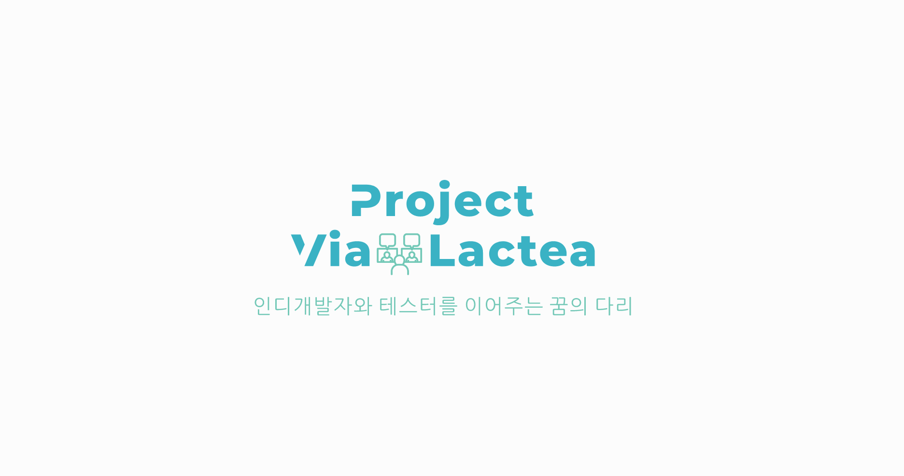

<!-- DESCRIPTION -->
<!--
***
*** Guide to Project Via Lactea
***
*** @author  AhHyeon An <toto1444@gmail.com>
*** @version 1.1
*** @since   2020-09-27
*** @latest  2020-12-07 16:30
***
-->

<!-- NOTE FOR CONTRIBUTERS -->
<!--
*** Dec 03 2020, From: AhHyeon An <toto1444@gmail.com>
***
*** Dear contributers, I Ahhyeon An<toto1444@gmail.com> recently added and modified
*** a bunch of stuff to our project Project-Via-Lactea.
*** Before do farder work, I extremely recommend reviewing recent changes.
***
*** Thank you for all you guys dedication and contribution.
***
*** Senior General Project Manager and Lead Programmer&Designer,
***
*** Ahhyeon An
***
-->

<!-- PROJECT SHIELDS -->
<!--
*** I'm using markdown "reference style" links for readability.
*** Reference links are enclosed in brackets [ ] instead of parentheses ( ).
*** See the bottom of this document for the declaration of the reference variables
*** for contributors-url, forks-url, etc. This is an optional, concise syntax you may use.
*** https://www.markdownguide.org/basic-syntax/#reference-style-links
-->
[![Contributors][contributors-shield]][contributors-url]
[![Forks][forks-shield]][forks-url]
[![Stargazers][stars-shield]][stars-url]
[![Issues][issues-shield]][issues-url]
[![MIT License][license-shield]][license-url]
[![LinkedIn][linkedin-shield]][linkedin-url]


<!-- PROJECT LOGO -->
<br />
<p align="center">
  <a href="https://github.com/toto1444/Project-Via-Lactea">
    
  </a>

  <h3 align="center">Project Via Lactea</h3>

  <p align="center">
    Project Via Lactea is the pletform that connects devloper and tester
    <br />
    <a href="https://github.com/toto1444/Project-Via-Lactea/tree/master/Docs"><strong>Explore the docs »</strong></a>
    <br />
    <br />
    <a href="README_ko.md">ReadMe - 한국어 버전</a>
    ·
    <a href="*">View Demo - Not avaliable yet</a>
    ·
    <a href="https://github.com/toto1444/Project-Via-Lactea/issues">Report Bug</a>
    ·
    <a href="https://github.com/toto1444/Project-Via-Lactea/issues">Request Feature</a>
  </p>
</p>


<!-- TABLE OF CONTENTS -->
## Table of Contents

* [About the Project](#about-the-project)


<!-- ABOUT THE PROJECT -->
## About The Project

[![Product Name Screen Shot][roduct-screenshot]](https://*)

This ReadMe page currently under-construction:
**Please be patience**
`toto1444`, `hanjiwoong`, `Moon19ht`


### Built With


**Under-construction**
<!--
* []()
* []()
* []()
-->


<!-- GETTING STARTED -->
## Getting Started

To get a local copy up and running follow these simple steps.

### Prerequisites

This list is what you need to use the software and how to install them.
* npm
```sh
npm install npm@latest -g
```

Now, need to install Vue-cli, Vue-devtools, Electron
```
# npm install -g @vue/cli
# npm install -g @vue/devtools
# npm install -g electron
```

Alright! All done!
Everything should properly seted at this point.

**Under-construction**

### Installation

1. **Under-construction**


<!-- USAGE EXAMPLES -->
## Usage

**Under-construction**


<!-- ROADMAP -->
## Roadmap

See the [open issues](https://github.com/toto1444/Project-Via-Lactea/issues) for a list of proposed features (and known issues).


<!-- CONTRIBUTING -->
## Contributing

Contributions are what make this open source project such an amazing thing to be learn, inspire, and create. Any contributions you make are **greatly appreciated**.

1. Fork the Project
2. Create your Feature Branch (`git checkout -b dev/AwesomeFeature`)
3. Commit your Changes (`git commit -m 'Add some AwesomeFeature'`)
4. Push to the Branch (`git push origin dev/AwesomeFeature`)
5. Open a Pull Request


<!-- LICENSE -->
## License

Distributed under the GNU 3.0 License. See `LICENSE` for more information.


<!-- CONTACT -->
## Contact

AhHyeon An - [@twitter_handle](https://twitter.com/toto144) - email

Project Link: [https://github.com/toto1444/Project-Via-Lactea](https://github.com/toto1444/Project-Via-Lactea)


<!-- ACKNOWLEDGEMENTS -->
## Acknowledgements

* []()
* []()
* []()


<!-- MARKDOWN LINKS & IMAGES -->
<!-- https://www.markdownguide.org/basic-syntax/#reference-style-links -->
[contributors-shield]: https://img.shields.io/github/contributors/toto1444/repo.svg?style=flat-square
[contributors-url]: https://github.com/toto144/Project-Via-Lactea/graphs/contributors
[forks-shield]: https://img.shields.io/github/forks/toto1444/repo.svg?style=flat-square
[forks-url]: https://github.com/toto144/Project-Via-Lactea/network/members
[stars-shield]: https://img.shields.io/github/stars/toto1444/repo.svg?style=flat-square
[stars-url]: https://github.com/toto144/Project-Via-Lactea/stargazers
[issues-shield]: https://img.shields.io/github/issues/toto1444/repo.svg?style=flat-square
[issues-url]: https://github.com/toto144/Project-Via-Lactea/issues
[license-shield]: https://img.shields.io/github/license/toto1444/repo.svg?style=flat-square
[license-url]: https://github.com/toto144/Project-Via-Lactea/blob/master/LICENSE.txt
[linkedin-shield]: https://img.shields.io/badge/-LinkedIn-black.svg?style=flat-square&logo=linkedin&colorB=555
<!--[linkedin-url]: https://linkedin.com/in/toto1444
[product-screenshot]: readme-images/screenshot.png-->
