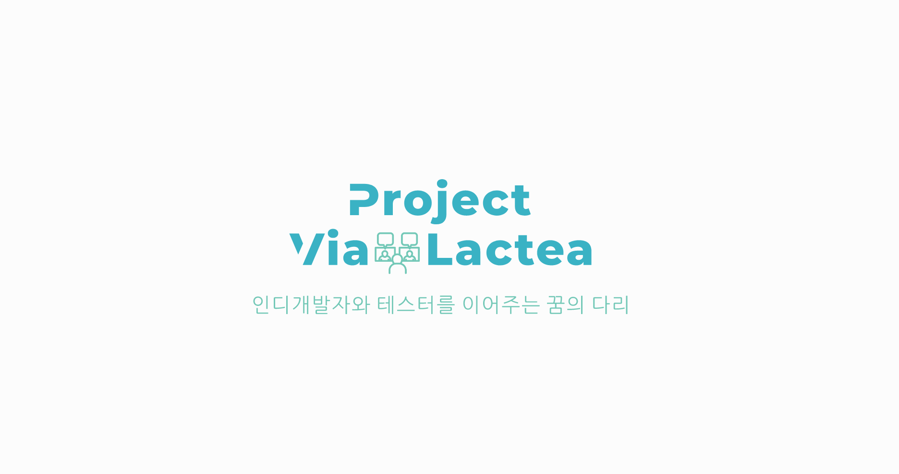

<!-- DESCRIPTION -->
<!--
***
*** Guide to Project Via Lactea
***
*** @author  AhHyeon An <toto1444@gmail.com>
*** @version 1.2
*** @since   2020-09-27
*** @latest  2020-12-07 16:29
***
-->

<!-- NOTE FOR CONTRIBUTERS -->
<!--
*** Dec 03 2020, From: AhHyeon An <toto1444@gmail.com>
***
*** Dear contributers, I Ahhyeon An<toto1444@gmail.com> recently added and modified
*** a bunch of stuff to our project Project-Via-Lactea.
*** Before do farder work, I extremely recommend reviewing recent changes.
***
*** Thank you for all you guys dedication and contribution.
***
*** Senior General Project Manager and Lead Programmer&Designer,
***
*** Ahhyeon An
***
-->

<!-- PROJECT SHIELDS -->
<!--
*** I'm using markdown "reference style" links for readability.
*** Reference links are enclosed in brackets [ ] instead of parentheses ( ).
*** See the bottom of this document for the declaration of the reference variables
*** for contributors-url, forks-url, etc. This is an optional, concise syntax you may use.
*** https://www.markdownguide.org/basic-syntax/#reference-style-links
-->
[![Contributors][contributors-shield]][contributors-url]
[![Forks][forks-shield]][forks-url]
[![Stargazers][stars-shield]][stars-url]
[![Issues][issues-shield]][issues-url]
[![MIT License][license-shield]][license-url]
[![LinkedIn][linkedin-shield]][linkedin-url]


<!-- PROJECT LOGO -->
<br />
<p align="center">
  <a href="https://github.com/toto1444/Project-Via-Lactea">
    
  </a>

  <h3 align="center">Project Via Lactea</h3>

  <p align="center">
    인디 게임 개발자와 게임 테스터 사이를 연결해주는 플랫폼입니다.
    <br />
    <a href="https://github.com/toto1444/Project-Via-Lactea/tree/master/Docs"><strong>문서로 보기 »</strong></a>
    <br />
    <br />
    <a href="README.md">ReadMe - English ver.</a>
    ·
    <a href="*">View Demo - Not avaliable yet</a>
    ·
    <a href="https://github.com/toto1444/Project-Via-Lactea/issues">Report Bug</a>
    ·
    <a href="https://github.com/toto1444/Project-Via-Lactea/issues">Request Feature</a>
  </p>
</p>


<!-- TABLE OF CONTENTS -->
## Table of Contents

* [About the Project](#about-the-project)


<!-- ABOUT THE PROJECT -->
## About The Project

[![Product Name Screen Shot][roduct-screenshot]](https://*)

현재 작성 된 ReadMe를 구성한 사람들: 
`toto1444`, `hanjiwoong`, `Moon19ht`


### Built With


**Under-construction**
<!--
* []()
* []()
* []()
-->


<!-- GETTING STARTED -->
## Getting Started

로컬 복사본을 가져오려면 다음과 같은 간단한 단계를 수행하십시오.

### Prerequisites

이 목록은 소프트웨어를 사용하는 데 필요한 것과 설치하는 방법입니다.
* npm
```sh
npm install npm@latest -g
```

이제 Vue-cli, Vue-devtools, Electron을 설치해야 합니다.
```
# npm install -g @vue/cli
# npm install -g @vue/devtools
# npm install -g electron
```

좋아요! 다 끝냈어요!
이 시점에서 모든 것이 제대로 설정되어야 합니다.

**Under-construction**

### Installation

1. **Under-construction**


<!-- USAGE EXAMPLES -->
## Usage

**Under-construction**


<!-- ROADMAP -->
## Roadmap

See the [open issues](https://github.com/toto1444/Project-Via-Lactea/issues) for a list of proposed features (and known issues).


<!-- CONTRIBUTING -->
## Contributing

당신이 프로젝트에 기여를 하면 이 오픈소스 프로젝트에 영감을 주고, 새롭고 놀라운 것을 창조하는 기적을 보일 것입니다. 기여한 것에 대해 **대단히 감사합니다**.

1. 프로젝트를 Fork하세요.
2. 자신의 기능적인 Branch를 만드세요. (`git checkout -b dev/AwesomeFeature`)
3. 자신이 코딩한 것에 대해 Commit 하세요. (`git commit -m 'Add some AwesomeFeature'`)
4. Branch에 Push 하세요. (`git push origin dev/AwesomeFeature`)
5. Pull Request를 여세요.


<!-- LICENSE -->
## License

Distributed under the GNU 3.0 License. See `LICENSE` for more information.


<!-- CONTACT -->
## Contact

AhHyeon An 
- Twitter:  [@toto1444](https://twitter.com/toto1444) 
- E-mail:   [@toto1444](mailto:toto1444@gmail.com?Subject=Project-Via-Lactea%20qustion)

SungRyong Kang 
- E-mail: [@ryan9947](ryan9947@daum.net?Subject=Project-Via-Lactea%20qustion)

Jiung Han 
- E-mail: [@smell2828](smell2828@daum.net?Subject=Project-Via-Lactea%20qustion)

Project Link: [https://github.com/toto1444/Project-Via-Lactea](https://github.com/toto1444/Project-Via-Lactea)


<!-- ACKNOWLEDGEMENTS -->
## Acknowledgements

* []()
* []()
* []()


<!-- MARKDOWN LINKS & IMAGES -->
<!-- https://www.markdownguide.org/basic-syntax/#reference-style-links -->
[contributors-shield]: https://img.shields.io/github/contributors/toto1444/repo.svg?style=flat-square
[contributors-url]: https://github.com/toto144/Project-Via-Lactea/graphs/contributors
[forks-shield]: https://img.shields.io/github/forks/toto1444/repo.svg?style=flat-square
[forks-url]: https://github.com/toto144/Project-Via-Lactea/network/members
[stars-shield]: https://img.shields.io/github/stars/toto1444/repo.svg?style=flat-square
[stars-url]: https://github.com/toto144/Project-Via-Lactea/stargazers
[issues-shield]: https://img.shields.io/github/issues/toto1444/repo.svg?style=flat-square
[issues-url]: https://github.com/toto144/Project-Via-Lactea/issues
[license-shield]: https://img.shields.io/github/license/toto1444/repo.svg?style=flat-square
[license-url]: https://github.com/toto144/Project-Via-Lactea/blob/master/LICENSE.txt
[linkedin-shield]: https://img.shields.io/badge/-LinkedIn-black.svg?style=flat-square&logo=linkedin&colorB=555
<!--[linkedin-url]: https://linkedin.com/in/toto1444
[product-screenshot]: readme-images/screenshot.png-->
